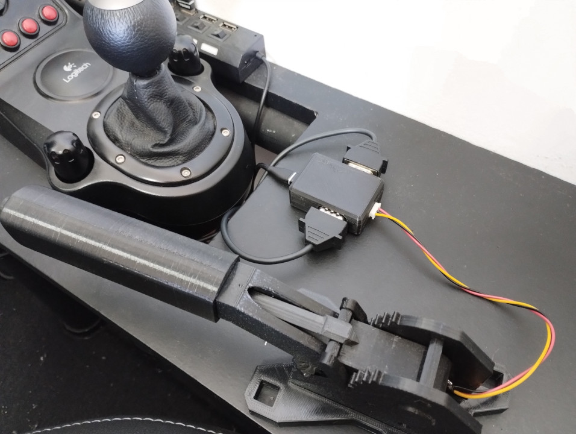
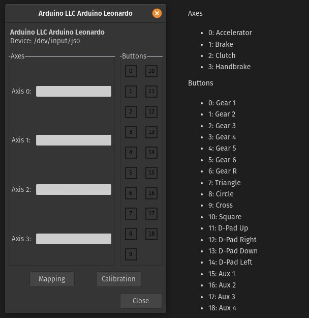
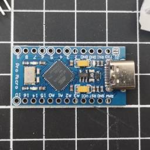
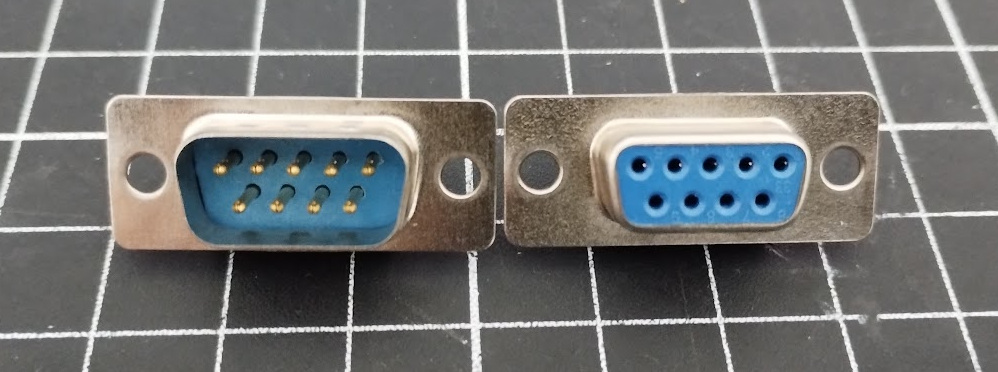
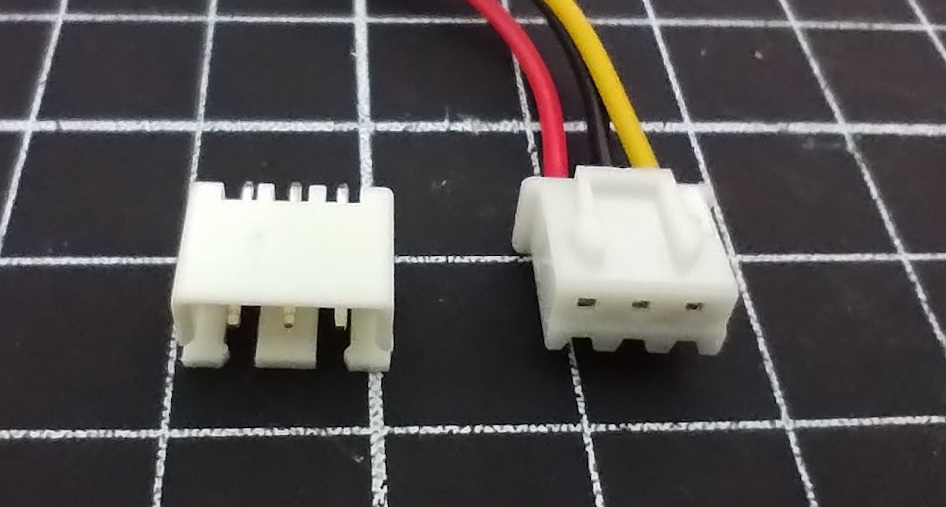
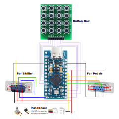
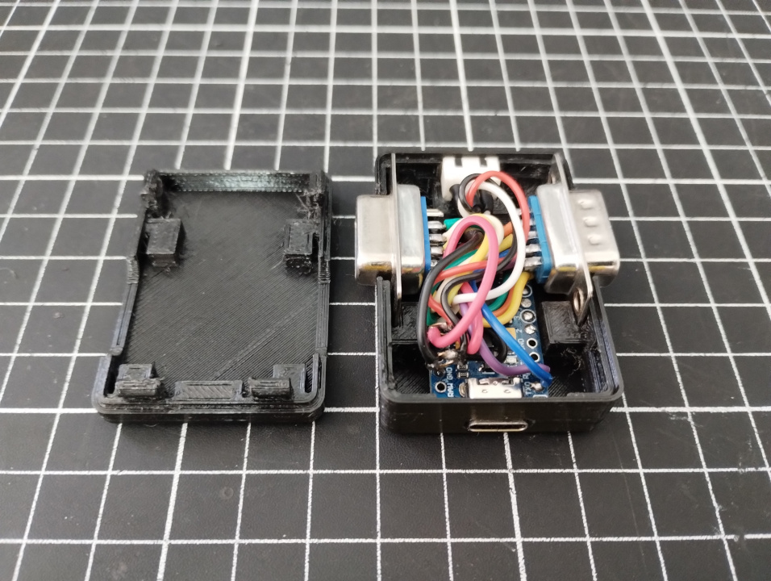

# G27 Adapter (with Handbrake and Button Box)



This adapter will allow you to connect a G27 shifter and G27 pedals standalone without the need for a G27 Steering Wheel.

Plus you can connect a Analog Handbrake and a Button Box of 16 Buttons.

**It is modular, you can connect only G27 shifter, only G27 pedals, only Handbrake, or all together simply commenting lines.**

# Features

- [x] G27 Shifter
- [x] G27 Pedals
- [x] Custom Handbrake
- [ ] Custom Button Box (ToDo)

# Settings



# Requirements

- 1x Arduino Pro Micro 16mhz 5v (USB C)

  

- 1x DB9 Pair (Male and Female)

  

- 1x JST XH 3 Pin Pair (Male and Female)

  

# Getting Started

Modify the file `modular-g27-adapter.ino` to customize your project.

1. **Configure only what you will use**<br />
   For example, if you are not going to use a `Custom Handbrake`, just comment `USE_HANDBRAKE`

```c
// Comment out the following lines to disable the respective input
#define USE_SHIFTER
#define USE_PEDALS
// #define USE_HANDBRAKE
```

2. **Configure pins as you need**<br />
   You can change these values if you have done otherwise than suggested in the `Wiring` section.

```c
// Pin definitions
#define PIN_SHIFTER_CLOCK 0
#define PIN_SHIFTER_DATA 1
#define PIN_SHIFTER_MODE 6
#define PIN_SHIFTER_X 8
#define PIN_SHIFTER_Y 9
#define PIN_PEDALS_ACCELERATOR 18
#define PIN_PEDALS_BRAKE 19
#define PIN_PEDALS_CLUTCH 20
#define PIN_HANDBRAKE 21
```

3. **Upload firmware to the Arduino Pro Micro**

# Wiring

This is just a wiring suggestion, but you can customize and change the pin definitions.

If you are going to use this suggestion it will just be `plug-n-play` with the current code.



Example


# Shell

https://www.printables.com/model/933848-g27-adapter-with-handbrake
