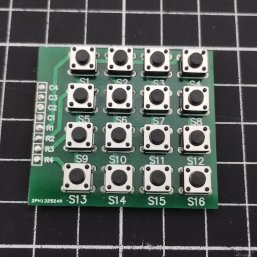

# G27 Adapter (with Handbrake and Button Box)


This adapter will allow you to connect a G27 shifter and G27 pedals standalone without the need for a G27 Steering Wheel.

Plus you can connect a Analog Handbrake and a Button Box of 16 Buttons.

**⚠️ HID Library is limited to only 32 buttons. If you use `#define USE_BUTTON_ARRAY`, be aware that the G27 Shifter's D-Pad will be disabled by default.**

# Features

- [x] G27 Shifter
- [x] G27 Pedals
- [x] Custom Handbrake
- [x] Custom Button Box

# Requirements

- Arduino Pro Micro 16mhz 5v (USB C)

  

- DB9 Pair (Male and Female)

  

- JST XH 3 Pin Pair (Male and Female)

  

- 4x4 Button Matrix Board

  

  **⚠️ Observation:** With this board, you don't necessarily have space limitations or need to use these buttons. You can use different types of buttons/switches as well, all you need is to solder the wires to the buttons of your choice and solder them to the button contacts on the back side of the board. Or simply you can make your own 4x4 Button Matrix, it doens't require any kind of different components, it's just a simple matrix of contact.

# Getting Started

Modify the file `arduino-g27-adapter.ino` to customize your project.

1. **Configure only what you will use**<br />
   For example, if you are not going to use a `Custom Button Box`, just comment `USE_BUTTON_ARRAY`

   ```c
   // Comment out the following lines to disable the respective input
   #define USE_SHIFTER
   // #define USE_BUTTON_ARRAY
   #define USE_PEDALS
   #define USE_HANDBRAKE
   ```

1. **Configure pins as you need**<br />
   You can change these values if you have done otherwise than suggested in the `Wiring` section.

   ```c
   // Pin definitions
   #define PIN_SHIFTER_CLOCK 0
   #define PIN_SHIFTER_DATA 1
   #define PIN_SHIFTER_MODE 6
   #define PIN_SHIFTER_X 8
   #define PIN_SHIFTER_Y 9
   #define PIN_PEDALS_ACCELERATOR 18
   #define PIN_PEDALS_BRAKE 19
   #define PIN_PEDALS_CLUTCH 20
   #define PIN_HANDBRAKE 21
   #define PIN_BUTTON_ARRAY_COLS \
     (int[4]) { 2, 3, 4, 5 }
   #define PIN_BUTTON_ARRAY_ROWS \
     (int[4]) { 10, 14, 15, 16 }
   ```

1. **Upload firmware to the Arduino Pro Micro**

# Troubleshooting

- **Wrong gear on the H Shifter**

  If your G27 H Shifter is shifting into the wrong gear, check and modify the limits in:

  ```c
  // Shifter tresholds
  #define TRESHOLD_SHIFTER_X_LEFT 350
  #define TRESHOLD_SHIFTER_X_RIGHT 650
  #define TRESHOLD_SHIFTER_Y_UP 700
  #define TRESHOLD_SHIFTER_Y_DOWN 200
  ```

- **Controller Conflict with another one**

  If your arduino is enter in conflict with other device, please try another value in the report id:

  ```c
  // Joystick Report ID
  #define JOYSTICK_REPORT_ID 0x03
  ```

# Wiring

This is just a wiring suggestion, you can customize and change in pin definitions.

If you are going to use this suggestion it will just be `plug-n-play` with the current code.


Example


# Shell

https://www.printables.com/model/933848-g27-adapter-with-handbrake
